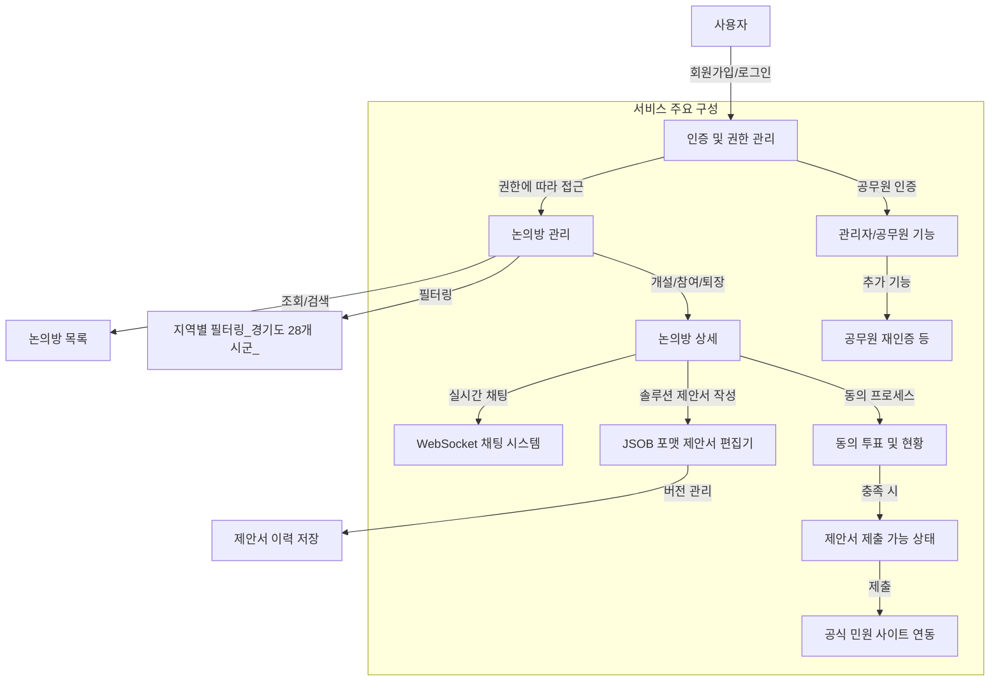

```mermaid
graph TD
    A[사용자] -->|회원가입/로그인| B[인증 및 권한 관리]
    B -->|권한에 따라 접근| C[논의방 관리]
    C -->|조회/검색| D[논의방 목록]
    C -->|필터링| E[지역별 필터링_경기도 28개 시군_]
    C -->|개설/참여/퇴장| F[논의방 상세]
    F -->|실시간 채팅| G[WebSocket 채팅 시스템]
    F -->|솔루션 제안서 작성| H[JSOB 포맷 제안서 편집기]
    H -->|버전 관리| I[제안서 이력 저장]
    F -->|동의 프로세스| J[동의 투표 및 현황]
    J -->|충족 시| K[제안서 제출 가능 상태]
    K -->|제출| L[공식 민원 사이트 연동]
    B -->|공무원 인증| M[관리자/공무원 기능]
    M -->|추가 기능| N[공무원 재인증 등]

    subgraph 서비스 주요 구성
        B
        C
        F
        G
        H
        J
        K
        L
        M
        N
    end
```